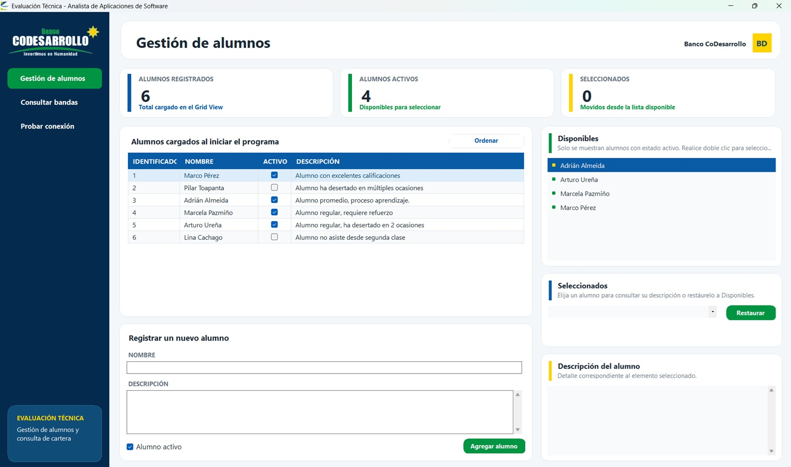
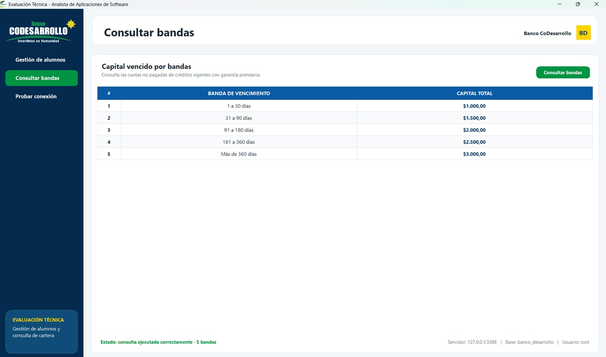
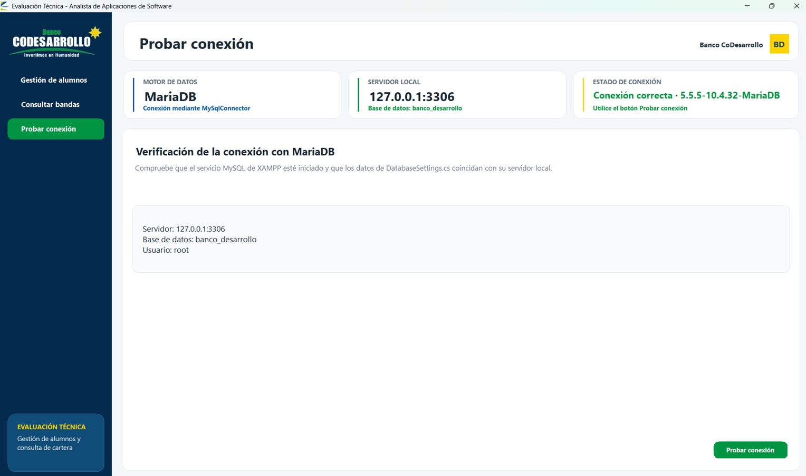

"# evaluacion_tecnica_carlos_ramos" 
# Evaluación Técnica - Analista de Aplicaciones de Software

<p align="center">
  
</p>

Aplicación de escritorio desarrollada con **C#**, **.NET 8**, **Windows Forms**, **LINQ** y **MariaDB**, creada para cumplir los requerimientos de la evaluación técnica indicada para el cargo de analista desarrollo de software.

El proyecto incluye dos componentes principales:

1. Gestión de alumnos mediante controles de Windows Forms.
2. Consulta de capital vencido por bandas desde una base de datos MariaDB.

---

## Funcionalidades implementadas

### Gestión de alumnos

- Carga automática de seis alumnos al iniciar el programa.
- Presentación de los alumnos en un `DataGridView`.
- Visualización de alumnos activos en un `ListBox` llamado **Disponibles**.
- Movimiento de alumnos activos hacia un `ComboBox` llamado **Seleccionados** mediante doble clic.
- Uso de LINQ para localizar, filtrar y ordenar alumnos.
- Eliminación automática del alumno de la lista **Disponibles** después de seleccionarlo.
- Opción para restaurar un alumno seleccionado a la lista **Disponibles**.
- Visualización de la descripción del alumno seleccionado.
- Ordenamiento alfabético de todos los alumnos por nombre.
- Registro de nuevos alumnos desde la interfaz.
- Generación automática del identificador del alumno.
- Actualización dinámica de los contadores de alumnos registrados, activos y seleccionados.

> Los alumnos se administran en memoria mediante una colección `List<Alumno>`, de acuerdo con el requerimiento de agregar elementos al `DataGridView`. La evaluación no solicita persistir alumnos en MariaDB.

### Consulta de capital vencido

La aplicación consulta el capital de cuotas vencidas y lo distribuye en las siguientes bandas:

| # | Banda de vencimiento |
|---:|---|
| 1 | 1 a 30 días |
| 2 | 31 a 90 días |
| 3 | 91 a 180 días |
| 4 | 181 a 360 días |
| 5 | Más de 360 días |

La consulta considera únicamente:

- Cuotas no pagadas.
- Créditos con estado `VIGENTE`.
- Créditos con garantía `PRENDARIA`.
- Cuotas cuya fecha de vencimiento sea anterior a la fecha actual.

El número de días vencidos se calcula mediante:

```sql
DATEDIFF(CURDATE(), fecha_vencimiento)
```

Los resultados se muestran dinámicamente en un `DataGridView`.

### Verificación de conexión

La aplicación incluye una sección independiente para:

- Probar la conexión con MariaDB.
- Mostrar el servidor configurado.
- Mostrar el puerto.
- Mostrar la base de datos.
- Mostrar el usuario de conexión.
- Informar la versión del servidor cuando la conexión es exitosa.

---

## Tecnologías utilizadas

- C#
- .NET 8
- Windows Forms
- LINQ
- MariaDB / MySQL
- XAMPP
- MySqlConnector
- SQL
- Git y GitHub
- Visual Studio 2022

---

## Estructura del repositorio

La estructura publicada en GitHub debe quedar de la siguiente manera:

```text
banco_desarrollo_net/
├── .gitignore
├── README.md
├── EvaluacionTecnica.sln
│
├── database/
│   ├── creacion_esquema_BDD.sql
│   ├── fabrica_datos.sql
│   └── consulta_datos.sql
│
├── docs/
│   └── capturas/
│       ├── gestion-alumnos.jpg
│       ├── consulta-bandas.jpg
│       └── probar-conexion.jpg
│
└── src/
    └── EvaluacionTecnica.WinForms/
        ├── Data/
        │   ├── DatabaseSettings.cs
        │   └── MariaDbService.cs
        │
        ├── Forms/
        │   └── MainForm.cs
        │
        ├── Images/
        │   ├── bdd.png
        │   └── logo_bdd.png
        │
        ├── Models/
        │   ├── Alumno.cs
        │   └── BandaVencimiento.cs
        │
        ├── EvaluacionTecnica.WinForms.csproj
        └── Program.cs
```

---

## Capturas de la aplicación

### Gestión de alumnos



### Consulta de bandas



### Prueba de conexión



---

## Requisitos para ejecutar el proyecto

- Windows 10 u 11.
- Visual Studio 2022.
- SDK de .NET 8.
- XAMPP con el servicio MySQL/MariaDB.
- phpMyAdmin o cualquier cliente compatible con MariaDB.
- Acceso a Internet para restaurar paquetes NuGet la primera vez.

---

## Configuración de MariaDB

La aplicación utiliza la siguiente configuración local:

```text
Servidor: 127.0.0.1
Puerto: 3306
Base de datos: banco_desarrollo
Usuario: root
Contraseña: vacía
```

Esta configuración se encuentra en:

```text
src/EvaluacionTecnica.WinForms/Data/DatabaseSettings.cs
```

```csharp
namespace EvaluacionTecnica.WinForms.Data;

/// <summary>
/// Configuración local para la conexión con MariaDB.
/// </summary>
public static class DatabaseSettings
{
    public const string Server = "127.0.0.1";
    public const uint Port = 3306;
    public const string Database = "banco_desarrollo";
    public const string UserId = "root";
    public const string Password = "";
}
```

---

## Preparación de la base de datos

### 1. Iniciar MariaDB

Abrir XAMPP e iniciar el servicio **MySQL**.

### 2. Abrir phpMyAdmin

Desde XAMPP, seleccionar **Admin** en el servicio MySQL o ingresar a phpMyAdmin desde el navegador.

### 3. Ejecutar los scripts SQL

Importar los archivos de la carpeta `database` en el siguiente orden:

```text
1. creacion_esquema_BDD.sql
2. fabrica_datos.sql
3. consulta_datos.sql
```

| Archivo | Propósito |
|---|---|
| `creacion_esquema_BDD.sql` | Crea la base de datos y las tablas requeridas. |
| `fabrica_datos.sql` | Inserta datos válidos y registros de control para comprobar los filtros. |
| `consulta_datos.sql` | Ejecuta la consulta del capital distribuido por bandas. |

---

## Tablas de la base de datos

### `tipo_garantia`

Contiene los tipos de garantía disponibles: prendaria y quirografaria.

### `credito`

Contiene el número del crédito, estado, tipo de garantía y sucursal.

### `cuota_credito`

Contiene el número del crédito, número de cuota, fecha de vencimiento, capital, interés, mora, estado de pago y sucursal.

---

## Ejecución de la aplicación

1. Clonar o descargar el repositorio.
2. Iniciar MySQL desde XAMPP.
3. Importar los scripts SQL en el orden indicado.
4. Abrir `EvaluacionTecnica.sln`.
5. Esperar a que Visual Studio restaure los paquetes NuGet.
6. Verificar que `EvaluacionTecnica.WinForms` sea el proyecto de inicio.
7. Ejecutar la solución con `F5`.

También se puede compilar desde una terminal ubicada en la raíz:

```bash
dotnet restore
dotnet build
dotnet run --project src/EvaluacionTecnica.WinForms/EvaluacionTecnica.WinForms.csproj
```

---

## Paquete NuGet utilizado

El proyecto utiliza `MySqlConnector` para abrir la conexión, ejecutar la consulta SQL y leer los resultados obtenidos desde MariaDB.

---

## Flujo de evaluación recomendado

### Gestión de alumnos

1. Ejecutar el programa.
2. Verificar que aparezcan seis alumnos en el `DataGridView`.
3. Confirmar que **Disponibles** muestre solamente alumnos activos.
4. Realizar doble clic sobre un alumno disponible.
5. Verificar que el alumno aparezca en **Seleccionados**.
6. Comprobar que desaparezca de **Disponibles**.
7. Seleccionarlo en el `ComboBox` y revisar su descripción.
8. Utilizar el botón **Restaurar**.
9. Confirmar que el alumno vuelva a **Disponibles**.
10. Presionar **Ordenar alfabéticamente**.
11. Registrar un alumno nuevo.
12. Verificar que su identificador se genere automáticamente.

### Consulta SQL

1. Abrir la opción **Probar conexión**.
2. Presionar **Probar conexión**.
3. Confirmar que se muestre una conexión exitosa.
4. Abrir la opción **Consultar bandas**.
5. Presionar **Consultar bandas**.
6. Comprobar que aparezcan las cinco bandas de vencimiento.
7. Verificar que la tabla muestre el capital total de cada banda.

---

## Datos de prueba esperados

Con los registros incluidos en `fabrica_datos.sql`, se esperan resultados similares a:

| # | Banda de vencimiento | Capital total |
|---:|---|---:|
| 1 | 1 a 30 días | $1.000,00 |
| 2 | 31 a 90 días | $1.500,00 |
| 3 | 91 a 180 días | $2.000,00 |
| 4 | 181 a 360 días | $2.500,00 |
| 5 | Más de 360 días | $3.000,00 |

También se incluyen registros que deben quedar excluidos por cuota pagada, garantía quirografaria, crédito cancelado o fecha de vencimiento futura.

---

## Autor

**Carlos Miguel Ramos Bravo**

Proyecto desarrollado como parte de una evaluación técnica para el cargo de Analista de Aplicaciones de Software.
